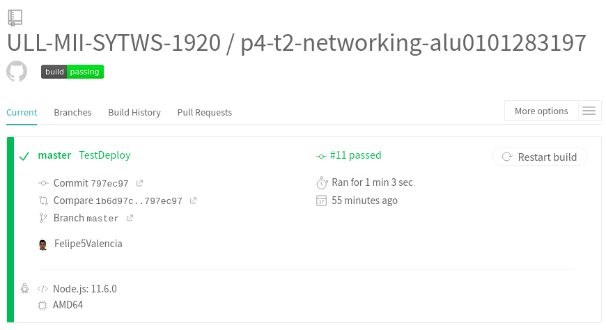

# **Práctica 4**
## Networking

### 1. Connecting to a TCP Socket with netcat

### 2. Listening on unix sockets

### 3. Switching to JSON

### 4. Socket Client Connections

### 5. Implementing a Test Service

### 6.Unit Test whith Mocha

### GithubActions

Para la ejecución de las acciones es necesario crear dentro de nuestro proyecto una carpeta ".github" que a su vez contendrá una carpeta que se llame "workflows". Dentro de ella, crearemos un archivo con formato YAML donde estableceremos las reglas de ejecución.

Nombre de la acción y momento en el cual se ejecuta. Para este caso, cada que se realice un PUSH se ejecutará la acción.

Entorno en el cual se quiere realizar la ejecución (puede ser támbien MacOS o Windows) y versión de Node. Se ejecutará en las 3 versiones de Node disponibles. Debe ejecutarse en al menos 1.

La variable Steps nos indica los pasos a seguir. Se definen en el, las acciones esenciales (usar actions/checkout@v2 y actions/setup-node@v1) y las acciones que queremos que realice. Esta acción está encargada de:
- Obtener e imprimir la hora de inicio
- Configurar el ambiente
- Realizar un Npm install, build y test
- Obtener e imprimir la hora de fin

El resultado del push sería el siguiente:

### Travis CI

A través de Travisci.org se realiza la integración con la cuenta y el repositorio de github en el cual se requiere utilizar esta herramienta. Despues de realizar el link entre Travis y Github es necesario generar un token en github para darle acceso a travis.

El archivo de configuración de travis se encarga de realizar el test y build de la aplicación, adicional, se encarga de desplegar en GithubPages el sitio web que se ha construido. Para este caso, con el objetivo de tener un contenido para visualizar, se utilizó una aplicación base de [React](https://github.com/mehulmpt/demo-app.git)

Resultados del Build de Travis CI: [Link](https://travis-ci.com/github/ULL-MII-SYTWS-1920/p4-t2-networking-alu0101283197)

Resultado del último despliegue:

GitHubPage:

https://ull-mii-sytws-1920.github.io/p4-t2-networking-alu0101283197/

